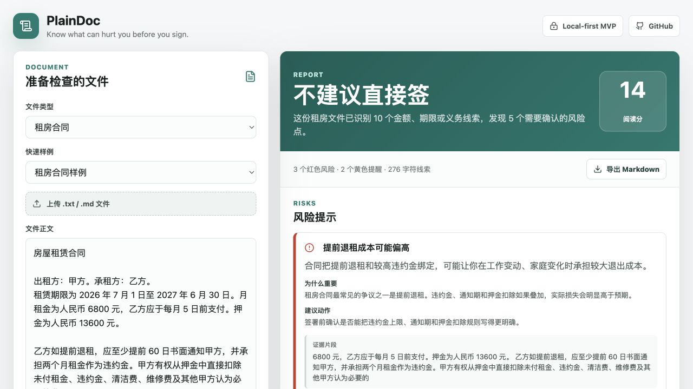

# PlainDoc

PlainDoc turns everyday professional documents into plain-language risk notes and signing checklists.

The first version focuses on rental, employment, renovation, loan, and insurance documents. It is local-first, open-source, and runnable without API keys. An optional AI-enhanced mode can call an OpenAI-compatible model service that the user configures.

> Know what can hurt you before you sign.



## What It Does

Paste a contract, upload a selectable-text PDF, or load one of the bundled fictional scenarios. PlainDoc produces:

- A one-sentence summary.
- Key facts such as money, dates, obligations, penalties, and acceptance terms.
- Local document-type detection for pasted or uploaded text.
- Red/yellow/green risk cards with evidence snippets.
- One-click evidence locating back to the original text in the editor, with paragraph fallback when the snippet was lightly edited.
- A priority brief that surfaces the first issues to negotiate.
- Suggested clause edits for flagged risks.
- A copyable clause-edit pack for sending all proposed changes together.
- A signing checklist you can copy before talking to the other party.
- A next-step action plan and a message draft you can send back for clarification.
- Plain-language explanations for non-experts.
- Deduplicated local report history for revisiting recent analyses.
- One-click current-workspace clearing after reviewing sensitive documents.
- One-click copy for the full Markdown report.
- Markdown export with document-type and timestamped filenames for saving or sharing the report.
- Print-friendly report view for saving as PDF or bringing to an offline discussion.
- Optional AI-enhanced analysis with local-rule fallback.
- Local sensitive-data preflight warning and one-click redacted copy before AI model sending.
- Explicit per-session confirmation before sending document text to a configured model service.

PlainDoc is not a legal-advice product. It is a document-reading assistant that helps ordinary people spot questions worth asking.

## Why This Exists

Most "chat with PDF" tools ask users to know what to ask. PlainDoc starts from the opposite assumption: ordinary people often do not know which clauses matter.

The goal is to package professional reading patterns into a tool that gives users a concrete next step before they sign.

## Quick Start

```bash
npm install
npm run dev
```

Open the local Vite URL and try one of the bundled examples.

Run checks:

```bash
npm test
npm run build
```

## AI-Enhanced Mode

PlainDoc works without a model by default. The browser runs local heuristic rules first, then optionally asks your configured model service to improve the summary, risk cards, checklist, and plain-language explanation. AI-enhanced findings are conservatively merged with the local baseline so evidence snippets from local rules stay attached to the relevant risk cards.

To use it:

1. Enable **AI 增强分析** in the left panel.
2. Enter an OpenAI-compatible endpoint, model name, and API key.
3. Confirm **本次允许发送正文给模型服务**.
4. Click **生成 AI 增强清单**.

Privacy boundary:

- When AI mode is off, PlainDoc does not send document text anywhere.
- PDF text extraction runs in your browser before analysis.
- Recent report history is stored in your browser, deduplicates repeated analyses, and stores report conclusions and suggestions only. It does not store the original document text or evidence snippets. Restoring a history report clears the editor so stale text is not shown beside the restored report.
- The current-workspace clear button removes the visible document text and current report without deleting report history or model settings.
- When AI mode is on, PlainDoc still uses local analysis unless you explicitly confirm **本次允许发送正文给模型服务**. Without that confirmation, the report is generated locally.
- Before AI sending, PlainDoc locally checks whether the visible text appears to contain common sensitive data categories such as phone numbers, email addresses, ID numbers, or bank card numbers. It only shows category labels and does not store or display the matched values. You can generate a local redacted copy that replaces those values with placeholders before confirming model sending.
- Changing the document text, loading an example, uploading a file, restoring a history report, clearing the workspace, or changing the model endpoint/model/API key cancels the send confirmation.
- After confirmation, PlainDoc sends up to the first 12,000 characters of the document text from your browser to the endpoint you configured. The full document is still analyzed locally, and long AI-enhanced reports include a notice when the model only received the front section.
- The local baseline sent to the model omits evidence snippets, so extracted raw evidence from outside the sent text range is not included in the model request.
- If the document or model settings change while an AI request is still in flight, the stale model result is ignored instead of replacing the current report.
- You can cancel an in-flight AI analysis. PlainDoc asks the browser to abort the model request, keeps the current report on the local-rule result, and still ignores any canceled model result if it returns later.
- AI model requests automatically time out instead of leaving the page stuck in analysis; timeout failures fall back to the local-rule report.
- The API key is session-only by default. It is written to browser localStorage only when you explicitly enable **记住 API key**, and can be cleared from the UI.
- If the model call fails, PlainDoc falls back to the local report and shows the failure reason.
- When AI mode improves a local risk card, PlainDoc keeps the local evidence snippet instead of replacing it with unsupported model text.

## Current Scope

Supported in this MVP:

- Paste text.
- Pasted or edited text immediately refreshes the local-rule report so the visible report stays aligned with the editor.
- Upload selectable-text PDF, `.txt`, and `.md` files.
- Successful uploads immediately refresh the local-rule report so the visible report matches the uploaded text.
- Load ten fictional rental, employment, renovation, loan, and insurance examples.
- Switching bundled examples immediately refreshes the local-rule report so the demo text and report stay aligned.
- Changing the document type immediately regenerates the local-rule report with that rule pack.
- Automatically detect the closest supported document type for uploaded or uncertain text.
- Analyze common loan and borrowing clauses.
- Analyze common insurance waiting-period, exclusion, renewal, and claim-notice clauses.
- Local heuristic analysis with no API key.
- Optional OpenAI-compatible model enhancement.
- Local sensitive-data category warning and redacted-copy helper before AI model sending.
- Per-session model-send confirmation that resets when the document or model destination changes.
- Transparent long-document AI scope notice when only the first 12,000 characters are sent to the configured model service.
- Automatic AI request timeout with local-rule fallback.
- Cancelable in-flight AI analysis with request abort and stale-result protection.
- Session-only API key handling by default, with explicit opt-in persistence.
- Conservative model/local merge that preserves evidence snippets on AI-enhanced risk cards.
- One-click original-text locating for risk evidence snippets, with paragraph-level fallback when exact snippet text no longer matches.
- Suggested clause edits for common risk patterns.
- Copyable clause-edit pack.
- Copyable next-step message draft for counterparties.
- Deduplicated local report history that omits original text and evidence snippets, clears the editor on restore, and supports one-click clear.
- One-click current-workspace clearing for sensitive document text and the current report.
- Markdown report export with readable timestamped filenames.
- Print-friendly report output for browser printing or saving as PDF.
- GitHub Pages-ready metadata, social preview image, and web app manifest.

Not yet supported:

- OCR for scanned PDFs or photos.
- Server-side model proxy or account-based key storage.
- Multi-language document packs.
- Account sync or cloud storage.

## Example Use Cases

- A renter wants to know whether deposit and early-exit clauses are risky.
- An employee wants to understand non-compete, penalty, and resignation notice clauses.
- A homeowner wants to check renovation payment milestones, change orders, and acceptance rules.
- A borrower wants to understand real borrowing cost, prepayment fees, overdue charges, and acceleration clauses.
- An insurance buyer wants to understand waiting periods, existing-condition exclusions, renewal stability, and claim notice deadlines.

## Disclaimer

PlainDoc provides document-reading assistance and risk prompts. It does not provide legal, medical, financial, or other professional advice. Important decisions should be reviewed with qualified professionals.

## Roadmap

See [docs/roadmap.md](docs/roadmap.md).

## Contributing

Contributions are welcome. The easiest useful contributions are:

- Add more fictional example documents.
- Improve local rule packs.
- Add tests for a new document pattern.
- Improve suggested clause-edit templates.
- Improve plain-language explanations.
- Improve action-plan and counterparty-message templates.
- Help implement OCR adapters and document ingestion edge cases.

See [CONTRIBUTING.md](CONTRIBUTING.md).

## Suggested GitHub Topics

`documents`, `contracts`, `plain-language`, `risk-checklist`, `local-first`, `loans`, `insurance`, `react`, `vite`, `open-source`

## License

MIT
